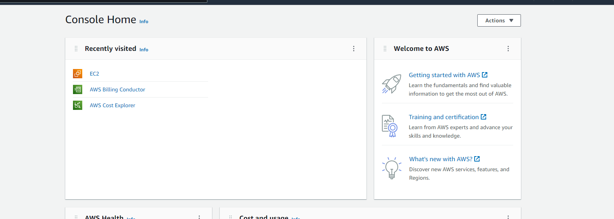
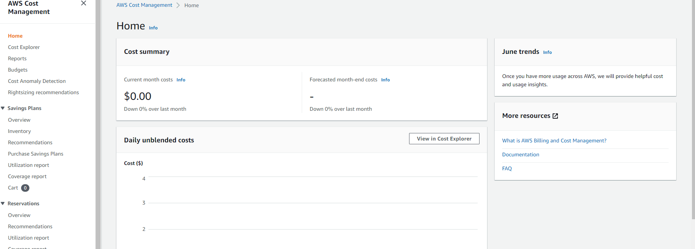
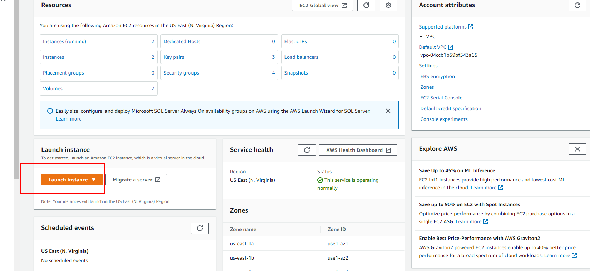
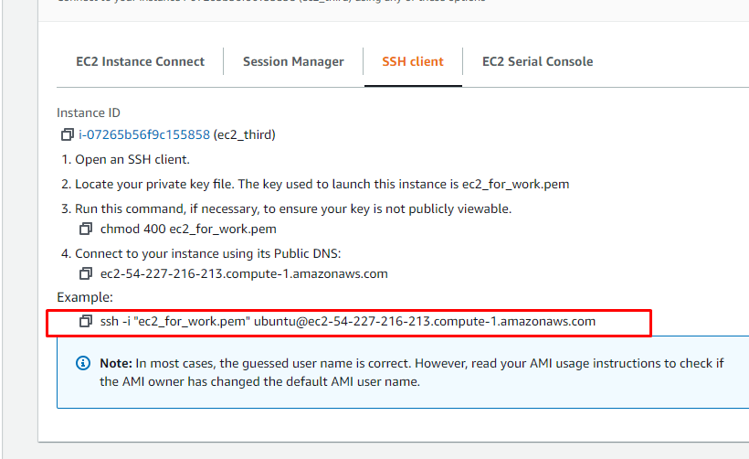
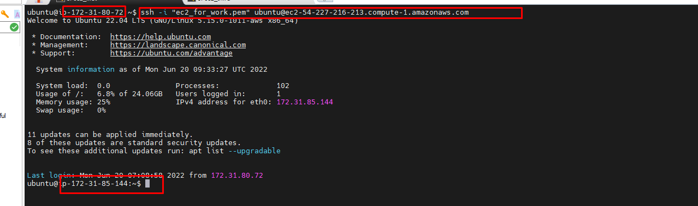
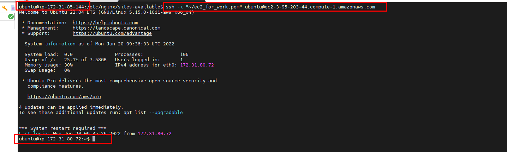
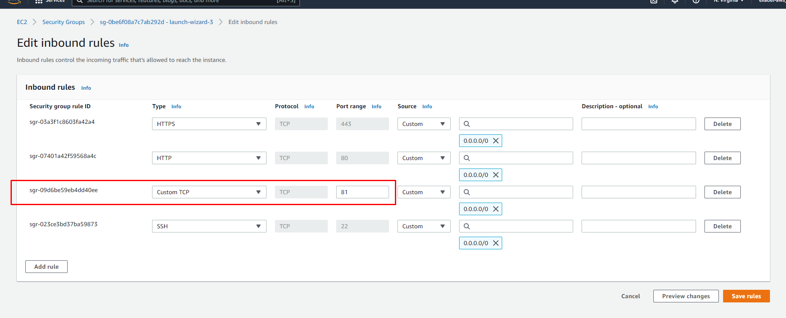
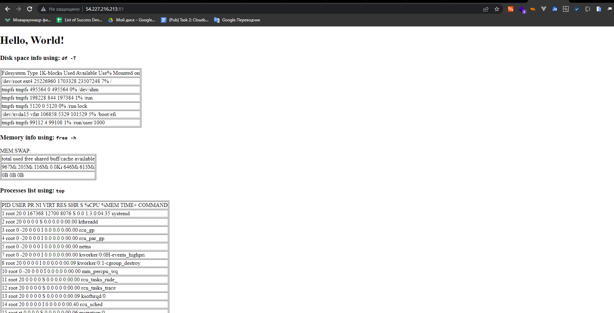

1.\  \
Main dashboard of AWS console\
2. \  \
dashboard of cost management\
3. \  \
Using ec2 dashboard it is possible to create new instances\
4. \  \
By pressing "CONNECT" it is possible to see info for connecting to instance via ssh.
For authorization while connecting it is used OpenSsh key which is generated at the time creating instance\
5.\ 
To support ssh connection between instances. We need create mutual ssh keyfile inside of home dir of instances. \
    \
    \
6.\ installed and configured nginx server: \
     a.\ 
     commands:\
           1. sudo apt update \
           2. systemctl status nginx \
     b.\ 
         wrote conf 
     c.\ 
         and last configured security group for necessary port 
        \
7.\result:\

    
    
