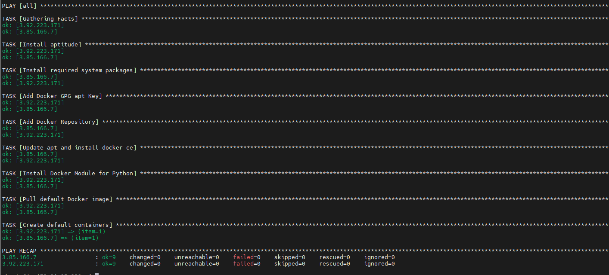

**TASK-5**

1.  **Deploy three virtual machines in the Cloud. Install Ansible on one
    of them:**

    **Instances:**

```{=html}
<!-- -->
```
1.  **54.166.216.21 (main)**

2.  **3.85.166.7**

3.  **3.92.223.171**

    

    Official documentation:
    <https://docs.ansible.com/ansible/latest/installation_guide/intro_installation.html>
    ***Commands:***

```{=html}
<!-- -->
```
1.  *curl https://bootstrap.pypa.io/get-pip.py -o get-pip.py*

2.  *python3 get-pip.py \--user*

3.  *python3 -m pip install \--user ansible*

4.  ***ansible \--version***

    ***Result:***

    

```{=html}
<!-- -->
```
2.  **Ping pong - execute the built-in ansible ping command. Ping the
    other two machines.**

    **Content of** *[hosts]{.ul}* **file:**

    

    **Commands:**

```{=html}
<!-- -->
```
1.  *ansible servers -i hosts -m ping*

    **Result:**

    

3.    **Write a playbook for installing Docker on two machines and run it.**

   

2.  **Commands**

```{=html}
<!-- -->
```
1.  **ansible-playbook -i hosts playbook.yaml**

    **3. Result:**

    

```{=html}
<!-- -->
```
1.  **Instance:**

    

2.  **Instance:**

    
